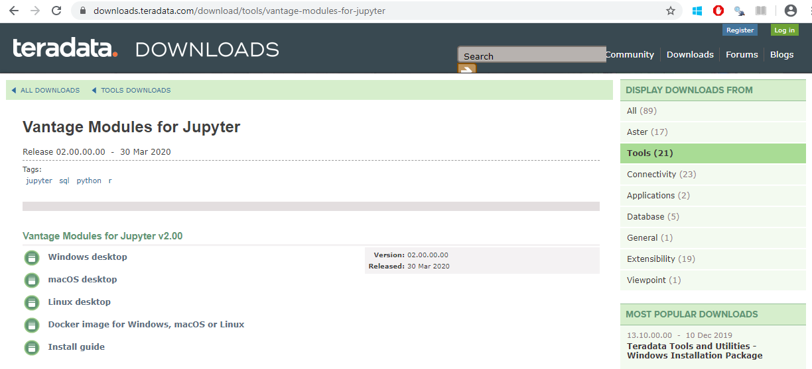

# Descargar JupyterLab

[Video Instructivo en Youtube](https://www.youtube.com/watch?v=0uiz73pFvqY)  

Para poder descargar la imagen de JupyterLab liberada por Teradata, vaya al siguiente enlace:

https://downloads.teradata.com/

Si no tiene una cuenta, es necesario que se registre antes de poder descargar la imagen. No se preocupe por sus datos personales, Teradata no los cede a terceros ni le llenará la bandeja de Spam. De hecho, el correo electrónico que usted declare sólo sirve para ingresar a la web de descargas.

Verifique su cuenta utilizando el mensaje que le llegue por correo electrónico. Recuerde su nombre de usuario y su password, los necesitará cada vez que quiera ingresar a descargar más componentes. 

IMPORTANTE: Recuerde que el nombre del usuario no necesariamente es el mismo que el correo electrónico.

Cuando se haya logueado con su cuenta, ingrese a la web de descarga

https://downloads.teradata.com/download/tools/vantage-modules-for-jupyter

Nosotros vamos a utilizar la imagen para Docker, pero usted podría instalar JupyterLab directamente en su sistema operativo utilizando las versiones correspondientes del instalador.

Para descargar la imagen, debe hacer clic en el enlace correcto. Se abrirá una ventana con un acuerdo de licencia. Luego de revisarlo, vaya a la parte final del documento y acepte. La descarga iniciará automáticamente.

Cuando haya finalizado la descarga, mueva el archivo a una ubicación en la que pueda utilizarlo en los siguientes pasos.
